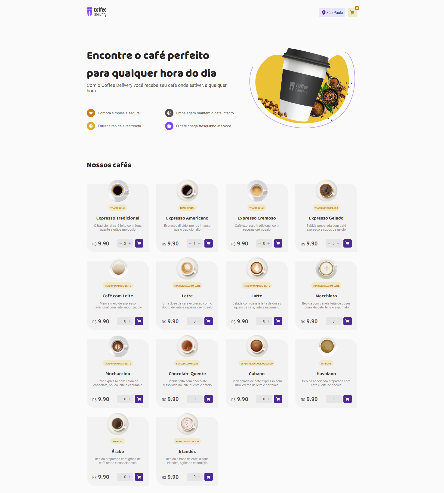
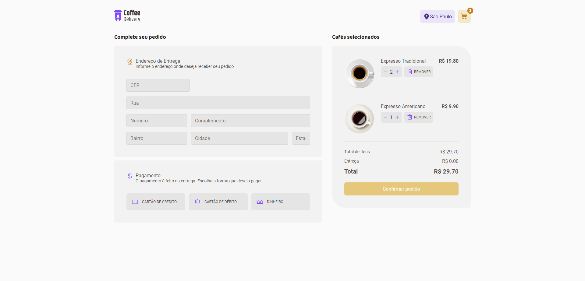

<h1 align="center">
  
</h1>

<p align="center">
  <a href="https://github.com/fernandogatto/" target="_blank">
    
  </a>

  

  
</p>

> Web application for coffee delivery.

## 🔗 Table of contents
- [Technologies](#technologies)
- [Documentation](#documentation)
- [Installation](#installation)
- [Getting start](#start)
- [Project](#project)
- [Contribute](#contribute)

## 📌 Technologies <a name="technologies"/>

- [ESLint](https://eslint.org/)
- [ReactJS](https://pt-br.reactjs.org/)
- [React Hook Form](https://www.react-hook-form.com/)
- [Styled Components](https://styled-components.com/)
- [Vite](https://vitejs.dev/)

## 🧠 Documentation <a name="documentation"/>

```bash
.
├── public                   # Vite files
├── src                      # Source files
│   ├── @types               # App types
│   ├── assets               # App files
│   ├── components           # App components
│   ├── constants            # App constants
│   ├── contexts             # App contexts api
│   ├── pages                # App pages
│   ├── reducers             # App reducers
│   ├── routes               # App routes
│   ├── styles               # App theme and global styles
│   └── utils                # Some util functions
└── README.md
```

## 📂 Installation <a name="installation"/>

First of all, it is important that you have installed [npm](https://www.npmjs.com/).

So, run this command in terminal to clone the project via HTTPS:

```bash
git clone https://github.com/fernandogatto/ignite-coffee-delivery
```

SSH URLs provide access to a Git repository via SSH, a secure protocol. If you have a SSH key registered in your Github account, clone the project using this command:

```bash
git@github.com:fernandogatto/ignite-coffee-delivery.git
```

**Install dependencies**

```bash
npm install
```

## 🚀 Getting start <a name="start"/>

Run the following command in order in terminal:

```bash
# Start the server
npm run dev
```

## 💻 Project <a name="project"/>

Home:



Cart:



## 🎨 Layout

To see the layout on Figma click [here](https://www.figma.com/file/52HvF43hBoggiJ6dXSHQOW/Coffee-Delivery-%E2%80%A2-Desafio-React-(Copy)?type=design&node-id=2-12&mode=design&t=6NOPgoQO3Vxu41Dp-0).

## 👍 Contribute <a name="contribute"/>

- Fork this repository.
- Create a branch with your resource: ```git checkout -b feature/my-feature```
- Submit changes: ```git commit -m "feat: My new feature"```
- Push your branch: ```git push origin feature/my-feature```

Build with 💙 by [Fernando Gatto](https://github.com/fernandogatto/).
